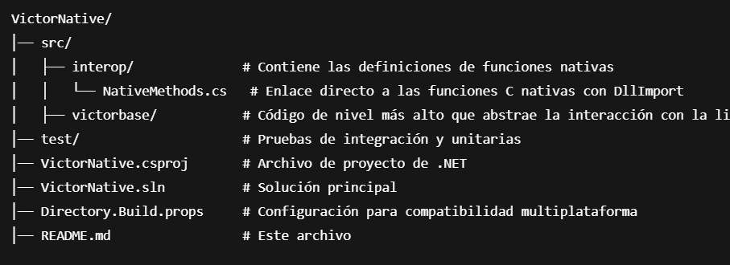

## Victor Base C# Binding - INDEV

- VictorNative es el binding de interoperabilidad en C# para la librería nativa Victor, proporcionando acceso eficiente a sus funcionalidades de indexación y búsqueda

## Estructura del proyecto

- Pendiente de generar más docs en los archivos fuente
- Pendiente abrir los primeros issues en cuanto estén otras implementaciones y la estructura final deiseñada.
